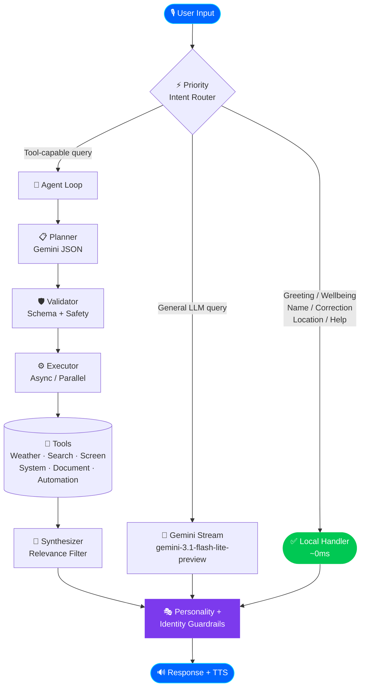
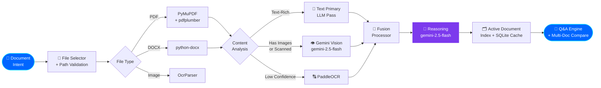
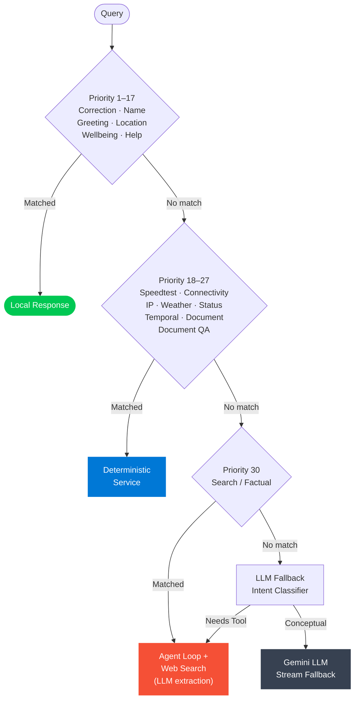

<div align="center">

[](.)

[](https://git.io/typing-svg)

<br/>

[](https://python.org)
[](CHANGELOG.md)
[](LICENSE)
[](.)
[](.)
[](https://ai.google.dev)
[](https://threejs.org)
[](CONTRIBUTING.md)

<br/>

[](.)
[](.)
[](.)
[](.)
[](.)
[](.)
[](.)

<br/>

> **A production-grade, reliability-first autonomous AI assistant** combining a priority intent router,
> a full Planner→Validator→Executor→Synthesizer agent loop, multimodal document intelligence,
> realtime voice output, OS-level system control, and a stunning Three.js adaptive plasma core UI.

<br/>

</div>

---

<p align="center">
  
</p>

---

## 📌 Table of Contents

<details>
<summary>Expand Navigation</summary>

- [✨ What is JARVIS?](#-what-is-jarvis)
- [🚀 Feature Highlights](#-feature-highlights)
- [🏗️ Architecture](#️-architecture)
- [🛠️ Tech Stack](#️-tech-stack)
- [⚡ Quick Start](#-quick-start)
- [⚙️ Configuration](#️-configuration)
- [🖥️ Run Modes](#️-run-modes)
- [📁 Project Structure](#-project-structure)
- [🗺️ Roadmap](#️-roadmap)
- [🤝 Contributing](#-contributing)
- [🔐 Security](#-security)
- [📜 License](#-license)
- [👤 Author](#-author)

</details>

---

## ✨ What is JARVIS?

**JARVIS** is not a chatbot. It is a full-stack, autonomous AI assistant runtime built around a strict **reliability-first principle** — meaning every answer that claims to be real-time actually is, every tool call is validated before synthesis, and every system action is OS-verified before being reported as successful.

At its core, JARVIS combines:

- **⚡ Sub-millisecond local routing** for greetings, identity, and conversational turns
- **🧠 A multi-step agent loop** (Plan → Validate → Execute → Synthesize) for tool-backed queries
- **📄 A hybrid document intelligence pipeline** fusing text extraction, OCR, and LLM vision
- **🎤 Real-time, streaming voice synthesis** via Edge neural TTS (`edge-tts`) with interruption-safe playback
- **🖥️ A pywebview desktop GUI** rendered through a Three.js adaptive plasma sphere with live telemetry

Every module enforces its own reliability contract. No hallucinated real-time data. No fake success confirmations. No persona drift.

---

## 🚀 Feature Highlights

| Category | Capability |
|---|---|
| 🧭 **Smart Routing** | LLM-powered intent classification with 30+ local fast-paths |
| 🧠 **Context-Aware Agent** | Planner and Synthesizer hold multi-turn conversation and profile context |
| 🌐 **Live Web Search** | Real-time web + news evidence via Gemini Grounding with automatic query reformulation |
| 🔍 **Factual Extraction** | Universal LLM extraction layer answering strict factual questions from search snippets |
| 🌦️ **Weather + Forecast** | Current conditions, daily forecasts, and rain probability via Open-Meteo |
| 📄 **Document Intelligence** | PDF · DOCX · Image — text extraction, PaddleOCR, Gemini Vision, SQLite caching |
| 💬 **Document Q&A** | Follow-up Q&A over analyzed documents without re-processing |
| ⚖️ **Multi-Doc Compare** | Pricing, risk, and feature comparison across multiple documents simultaneously |
| 👁️ **Screen Intelligence** | Screen/camera capture with structured analysis, object tracking, and latest-frame recall |
| 🧩 **Computer Automation** | Browser/UI task execution via `computer_control` autonomous action plans |
| 🎤 **Realtime TTS** | Edge neural voice synthesis (`edge-tts`) with interruption-safe playback |
| 🖥️ **App Control** | Open/close desktop apps with Start Menu indexing, fuzzy resolution, OS verification |
| 🔊 **System Control** | Volume · Brightness · Window management · Desktop control · Screen lock |
| 🌍 **Network Diagnostics** | Public IP · IP-based location · Connectivity probes · Speedtest |
| 🕒 **Temporal Awareness** | Precise time/date/day/month/year responses |
| 💾 **Persistent Memory** | JSON-backed user profile with session location and search context |
| 🎭 **Personality Engine** | Contextual humor system with anti-repetition guards and tone adaptation |
| ⏭️ **Skip Control** | UI button to safely interrupt active TTS mid-stream |
| 📊 **Live Telemetry** | CPU · RAM · Disk · Battery · Network · Uptime — all live in the HUD |

---

## 🏗️ Architecture

### Main Request Flow



### Document Intelligence Pipeline



### Intent Routing Precedence



---

## 🛠️ Tech Stack

| Layer | Technology | Role |
|---|---|---|
| **LLM Inference** |  `gemini-3.1-flash-lite-preview` | Planner · Synthesizer · Fast responses |
| **Deep Reasoning** |  `gemini-2.5-flash` | Document reasoning · Complex analysis |
| **Vision** |  `gemini-2.5-flash` | Document image extraction |
| **OCR** |  | Scanned PDFs · Images |
| **PDF Parsing** |  + pdfplumber | Text + table extraction |
| **Web Search** | ai.google.dev/gemini-api/docs/grounding | Live web + news evidence |
| **Weather** | Open-Meteo | Current + daily forecast |
| **TTS** | edge-tts + PyAudio | Edge neural voice synthesis and playback |
| **Desktop UI** |  + pywebview | Plasma core GUI |
| **Cache** |  + In-Memory LRU | Document intelligence cache |
| **Memory** | JSON-backed MemoryStore | Persistent user context |
| **App Control** | rapidfuzz + psutil + PowerShell | Fuzzy app resolution + OS verification |
| **System Control** | pycaw + screen-brightness-control + pygetwindow | Volume · Brightness · Windows |

---

## ⚡ Quick Start

### 1 · Clone

```bash
git clone https://github.com/deepakrakshit/jarvis.git
cd jarvis
```

### 2 · Create Virtual Environment

```bash
python -m venv venv

# Windows
venv\Scripts\activate

# macOS / Linux
source venv/bin/activate
```

### 3 · Install Dependencies

```bash
pip install -r requirements.txt
```

### 4 · Configure Environment

```bash
# Windows
copy .env.example .env

# macOS / Linux
cp .env.example .env
```

Open `.env` and set your keys:

```bash
GEMINI_API_KEY=your_gemini_api_key       # Required — get it free at console.ai.google.dev
GEMINI_SEARCH_MODEL=gemini-2.5-flash     # Optional override for grounded search model
HF_TOKEN=your_huggingface_token          # Optional — used for optional model/service workflows
```

### 5 · Launch

```bash
python jarvis.py
```

> **That's it.** The plasma UI opens, microphone connects, and JARVIS is ready.

---

## ⚙️ Configuration

<details>
<summary>📋 Full .env Reference</summary>

### 🔑 API Keys

| Variable | Required | Description |
|---|---|---|
| `GEMINI_API_KEY` | ✅ | Gemini inference API key |
| `HF_TOKEN` | ⬜ | HuggingFace token for voice model download |

### 🤖 Model Selection

| Variable | Default | Description |
|---|---|---|
| `GEMINI_MODEL` | `gemini-3.1-flash-lite-preview` | Primary fast model |
| `DOCUMENT_DEEP_MODEL` | `gemini-3.1-flash-lite-preview` | Document reasoning model |
| `DOCUMENT_VISION_PRIMARY_MODEL` | `gemini-3.1-flash-lite-preview` | Vision extraction model |

### 🎤 Voice Tuning

| Variable | Default | Description |
|---|---|---|
| `TTS_CHUNK_CHARS` | `28` | Characters per TTS chunk |
| `TTS_FIRST_CHUNK_DELAY` | `0.00` | Pre-speech delay (seconds) |
| `TTS_FRAMES_PER_BUFFER` | `1024` | PyAudio buffer size |
| `TTS_PLAYOUT_CHUNK_SIZE` | `2048` | Audio playout chunk size |

### 📄 Document Performance

| Variable | Default | Description |
|---|---|---|
| `DOCUMENT_OCR_MAX_WORKERS` | `6` | Parallel OCR workers |
| `DOCUMENT_VISION_MAX_WORKERS` | `4` | Parallel vision workers |
| `DOCUMENT_PDF_RENDER_DPI` | `140` | PDF page render resolution |
| `DOCUMENT_PDF_MAX_VISION_IMAGES` | `10` | Max pages sent to vision |
| `DOCUMENT_PDF_TABLE_MAX_PAGES` | `8` | Max pages for table extraction |
| `DOCUMENT_REASONING_DEFAULT_FAST` | `true` | Use fast model for reasoning by default |
| `DOCUMENT_ULTRA_FAST_ENABLED` | `true` | Skip LLM for simple text summaries |
| `DOCUMENT_SKIP_VISION_FOR_TEXT_RICH` | `true` | Skip OCR when text extraction is sufficient |
| `DOCUMENT_CACHE_ENABLED` | `true` | Enable SQLite result caching |
| `DOCUMENT_CACHE_TTL_SECONDS` | `86400` | Cache TTL (24 hours) |

</details>

---

## 🖥️ Run Modes

```bash
# Full experience: plasma GUI + CLI simultaneously (recommended)
python jarvis.py

# Desktop GUI only
python jarvis.py --gui

# CLI only (headless / server mode)
python jarvis.py --cli

# Explicit mode selection
python app/main.py --mode both
python app/main.py --mode gui
python app/main.py --mode cli
```

---

## 📁 Project Structure

```
jarvis/
├── agent/                  # Autonomous agent system
│   ├── agent_loop.py       # Main loop + fast-path gating
│   ├── planner.py          # Gemini-backed JSON plan generator
│   ├── executor.py         # Async parallel/sequential tool runner
│   ├── validator.py        # Schema + output validation + retry
│   ├── synthesizer.py      # Tool outputs → final response
│   └── tool_registry.py    # All tool definitions + factory
│
├── app/                    # Application launchers
│   ├── cli.py              # CLI mode
│   ├── desktop.py          # pywebview GUI mode
│   └── main.py             # Combined launcher + venv re-exec
│
├── core/                   # Orchestration + global policy
│   ├── runtime.py          # Primary orchestrator (~1000 lines)
│   ├── settings.py         # AppConfig + system prompt
│   ├── personality.py      # Response style + tone adaptation
│   ├── humor.py            # Contextual one-liner engine
│   └── time_utils.py       # Time-of-day utilities
│
├── services/               # Tool and domain service implementations
│   ├── actions/            # Agent-exposed tool actions
│   │   ├── app_control.py  # App open/close with OS verification
│   │   ├── coding_assist.py      # Project scaffolding + run orchestration
│   │   ├── file_controller.py    # Safe file/folder operations
│   │   ├── computer_control.py   # Desktop/browser automation actions
│   │   └── screen_processor.py   # Screen/camera capture + analysis
│   ├── system/             # System-level command/services
│   │   ├── cmd_control.py         # Guarded shell command execution
│   │   ├── system_service.py      # Unified system control facade
│   │   ├── system_validator.py    # Action + bounds validation policies
│   │   ├── system_models.py       # Canonical action model definitions
│   │   ├── volume_control.py      # Volume operations + keyboard fallback
│   │   ├── brightness_control.py  # Brightness operations + validation
│   │   ├── window_control.py      # Focus/minimize/restore/close window actions
│   │   ├── desktop_control.py     # Show desktop + desktop state operations
│   │   └── shortcut_control.py    # Safe key-combo shortcuts
│   ├── weather_service.py  # Open-Meteo weather + forecast
│   ├── network_service.py  # IP · connectivity · speedtest · status
│   ├── search_service.py   # Gemini Grounding web + news search
│   ├── intent_router.py    # Priority routing engine
│   ├── document/           # Full document intelligence pipeline
│   │   ├── pipeline.py     # Orchestrator: parse→OCR→vision→fuse→reason
│   │   ├── parsers/        # PDF · DOCX · OCR parsers
│   │   ├── processors/     # Chunker · Cleaner · Entities · Fusion · Retriever
│   │   ├── vision.py       # Gemini vision client + fallback chain
│   │   ├── ocr.py          # PaddleOCR processor
│   │   ├── qa_engine.py    # Retrieval-backed Q&A + multi-doc compare
│   │   ├── cache_store.py  # SQLite + in-memory LRU cache
│   │   └── document_service.py  # Top-level facade
│
├── frontend/               # Desktop UI (Three.js plasma core)
│   ├── index.html          # HUD layout
│   └── assets/
│       ├── main.js         # Three.js · mode waves · STT · telemetry
│       └── styles.css      # Orbitron HUD styling
│
├── interface/              # Python ↔ UI bridge
│   ├── api_bridge.py       # JarvisApi · JarvisBridge · metrics worker
│   └── cli_ui.py           # Boot sequence + input handler
│
├── memory/                 # Persistent context
│   └── store.py            # Thread-safe JSON memory store
│
├── voice/                  # Speech subsystem
│   └── tts.py              # Edge neural TTS engine with interruption safety
│
├── tests/stress/           # Stress test suites
├── docs/                   # Extended documentation
├── utils/                  # Shared utilities
└── jarvis.py               # Entry point
```

---

## 🗺️ Roadmap

| Status | Feature |
|---|---|
| ✅ | Priority intent routing with 30+ local fast-paths |
| ✅ | Full agent loop: Planner → Validator → Executor → Synthesizer |
| ✅ | Hybrid document pipeline: text + OCR + vision + fusion |
| ✅ | Multi-document comparison with evidence citations |
| ✅ | Retrieval-first document Q&A |
| ✅ | Edge Neural TTS with interruption-safe playback |
| ✅ | App control with fuzzy resolution + OS verification |
| ✅ | System control: volume · brightness · windows · desktop |
| ✅ | Three.js adaptive plasma core UI with live telemetry |
| ✅ | SQLite + in-memory two-tier document cache |
| ✅ | Ultra-fast deterministic reasoning lane |
| ⬜ | Plugin tool packs (extensible tool registry) |
| ⬜ | Deeper multi-agent planning strategies |
| ⬜ | Expanded multilingual voice + TTS safety controls |
| ⬜ | Document pipeline benchmark suite |
| ⬜ | Optional cloud memory sync |
| ⬜ | Linux / macOS platform support |
| ⬜ | Wake-word activation |

---

## 🤝 Contributing

Contributions are what make open source thrive. JARVIS follows a **reliability-first** philosophy — correctness and determinism always come before new features.

```bash
# 1. Fork → Clone → Branch
git checkout -b feat/your-feature-name

# 2. Make your changes

# 3. Run the stress suite
python -m unittest discover -s tests/stress -p "test_*.py" -v

# 4. Commit with structured messages
git commit -m "feat(agent): add planner optimization"

# 5. Push and open a PR
```

Read [CONTRIBUTING.md](CONTRIBUTING.md) for the full guide including commit conventions, code style requirements, and the PR checklist.

---

## 🔐 Security

Found a vulnerability? **Please do not open a public issue.**

Report privately via [GitHub Security Advisories](../../security/advisories/new) or direct maintainer contact. See [SECURITY.md](SECURITY.md) for the full policy.

---

## 📊 Star History

<div align="center">

[](https://star-history.com/#deepakrakshit/jarvis&Date)

</div>

---

## 📜 License

Distributed under the **MIT License**. See [LICENSE](LICENSE) for full terms.

---

## 👤 Author

<div align="center">

**Deepak Rakshit**

*Building reliable, production-grade AI systems* 🚀

[](https://github.com/deepakrakshit)

<br/>

*If JARVIS helped you, saved you time, or just looked really cool — a ⭐ means the world and helps others discover this project.*

</div>

---

<div align="center">

[](.)

</div>