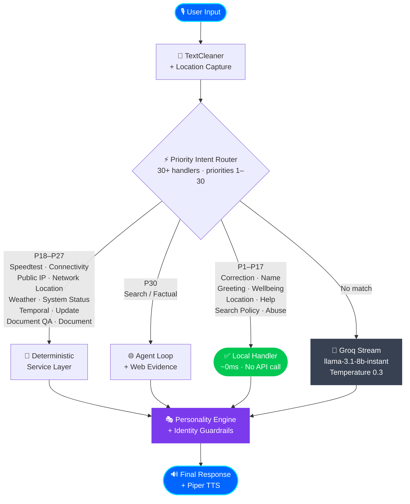
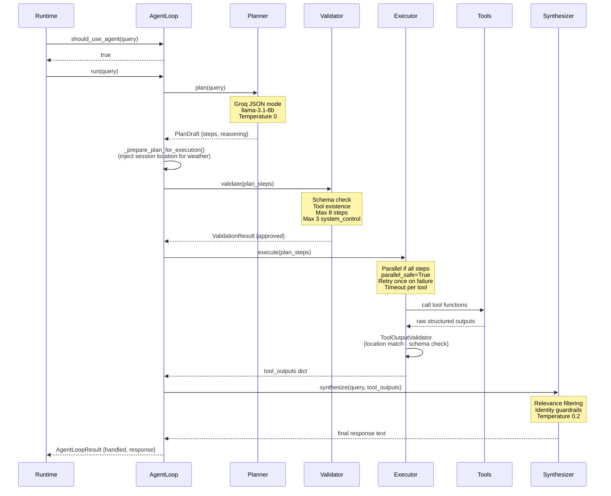
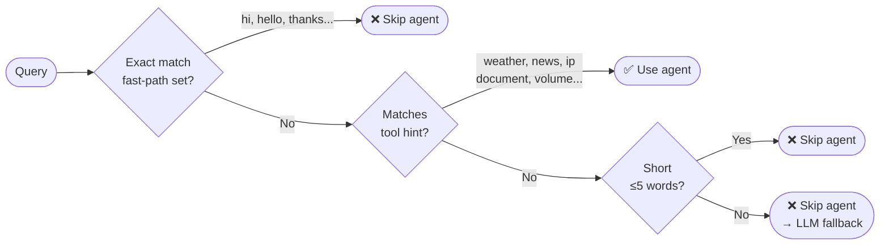
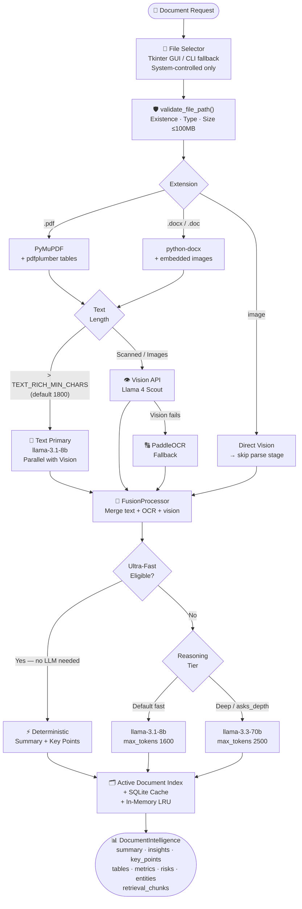
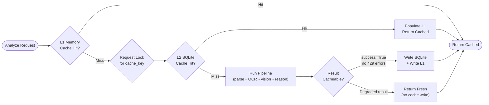
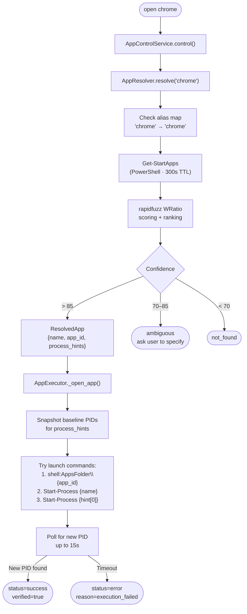
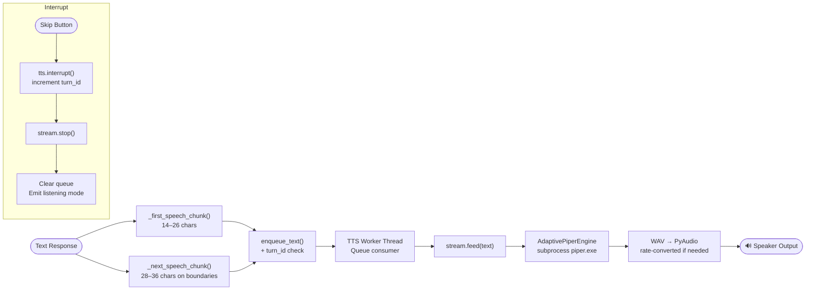
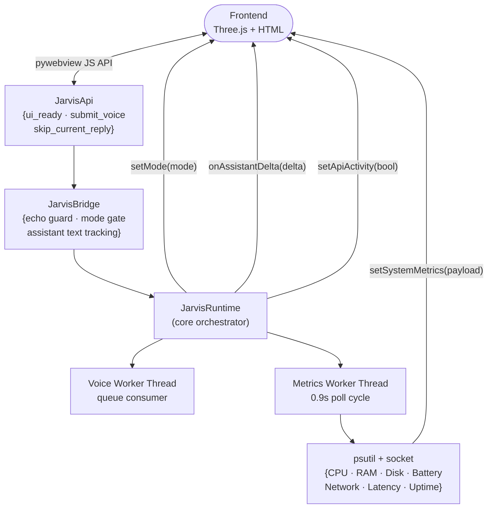

<div align="center">

[](.)

[](.)
[](.)
[](.)

</div>

---

## 🔭 System Overview

JARVIS is a **modular AI agent system** that combines three execution modes under a unified orchestrator:

1. **Local fast-path** — deterministic handlers for identity, greetings, and conversational turns (~0ms)
2. **Agent loop** — Planner → Validator → Executor → Synthesizer for tool-backed queries
3. **LLM stream fallback** — direct Groq streaming for general knowledge queries

The architecture is explicitly designed so that real-time data **always comes from tools**, never from LLM training data.

---

## 🔄 High-Level Request Flow



---

## 🧠 Agent Loop — Deep Dive

The agent loop is the intelligence core for all tool-backed requests.



### Fast-Path Bypass

Before invoking the planner, `AgentLoop.should_use_agent()` gates the query:



---

## 📄 Document Intelligence Pipeline

The document pipeline is a self-contained multimodal processing system with multiple quality tiers.



### Cache Architecture



---

## ⚙️ App Control Flow



---

## 🎤 Voice Pipeline



---

## 🖥️ Desktop UI Architecture



---

## ⚡ Performance Controls

All document throughput is tunable via `.env` — no code changes required.

| Variable | Default | Effect |
|---|---|---|
| `DOCUMENT_OCR_MAX_WORKERS` | `6` | Parallel PaddleOCR threads |
| `DOCUMENT_VISION_MAX_WORKERS` | `4` | Parallel Groq Vision requests |
| `DOCUMENT_PDF_RENDER_DPI` | `140` | Page image resolution for vision/OCR |
| `DOCUMENT_PDF_MAX_VISION_IMAGES` | `10` | Cap on pages sent to vision model |
| `DOCUMENT_PDF_MAX_OCR_IMAGES` | `16` | Cap on pages sent to OCR |
| `DOCUMENT_PDF_TABLE_MAX_PAGES` | `8` | Pages scanned for table extraction |
| `DOCUMENT_REASONING_DEFAULT_FAST` | `true` | Use 8b model unless depth requested |
| `DOCUMENT_ULTRA_FAST_ENABLED` | `true` | Skip LLM for simple summaries |
| `DOCUMENT_ULTRA_FAST_MIN_CHARS` | `700` | Minimum chars to qualify for ultra-fast |
| `DOCUMENT_SKIP_VISION_FOR_TEXT_RICH` | `true` | Skip vision when text extraction is sufficient |
| `DOCUMENT_TEXT_RICH_MIN_CHARS` | `1800` | Text length threshold for "text-rich" classification |
| `DOCUMENT_REASONING_TEXT_CHAR_BUDGET` | `22000` | Max chars sent to reasoning from text |
| `DOCUMENT_REASONING_OCR_CHAR_BUDGET` | `9000` | Max chars sent to reasoning from OCR |
| `DOCUMENT_REASONING_VISION_VISIBLE_CHAR_BUDGET` | `7000` | Max visible text from vision |
| `DOCUMENT_CACHE_TTL_SECONDS` | `86400` | SQLite cache entry lifetime |
| `DOCUMENT_CACHE_MAX_ENTRIES` | `256` | Max SQLite cache entries before pruning |

---

## 🛡️ Reliability Model

| Guarantee | Enforcement |
|---|---|
| No hallucinated real-time data | Tool refusal for disallowed-tool real-time requests |
| Retry on invalid tool output | `ToolOutputValidator` + `ToolExecutor` retry loop |
| Correct tool selection | `PlanValidator` schema enforcement |
| Deterministic system commands | `SystemControlValidator` with `_BLOCKED_ACTIONS` set |
| Verified source for factual queries | Synthesizer requires successful Serper results |
| Identity on final output | `_enforce_assistant_identity()` on every LLM response |
| Safe document path handling | `validate_file_path()` before any parsing |
| Bounded active document context | LRU eviction at `_active_documents_max_entries = 8` |
| OS-verified app open/close | `AppExecutor` polls for process existence before reporting success |
| No ambiguous connectivity routing | `CONNECTIVITY_RE` never matches `SEARCH_POLICY_RE` |
| Max/min volume/brightness safety | `SystemControlValidator` maps to explicit `set_*` actions |
| Synthesizer never claims unverified success | App/system control checks `verified=True` before confirming |

---

## 💾 State and Memory

```
data/user_memory.json
├── user_name          — stored name (e.g., "Deepak")
├── last_city          — last used weather city
├── last_search_query  — last search for follow-up resolution
├── last_speedtest     — {download_mbps, upload_mbps, ping_ms, timestamp, ...}
├── last_speedtest_error — last error string for correction handler
├── last_speedtest_requested_at — timestamp for freshness check
├── last_opened_app    — for "close it" pronoun resolution
├── user_country       — resolved from IP for speedtest benchmarking
└── prefer_web_for_facts — set when user gives search-policy feedback
```

---

<div align="center">

[](.)

</div>