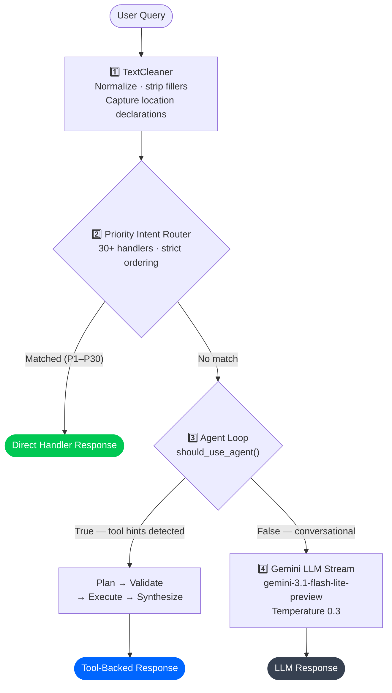
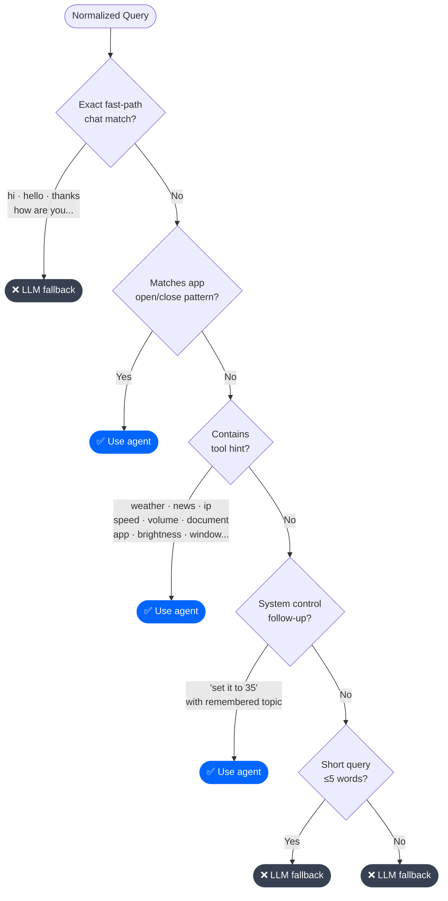
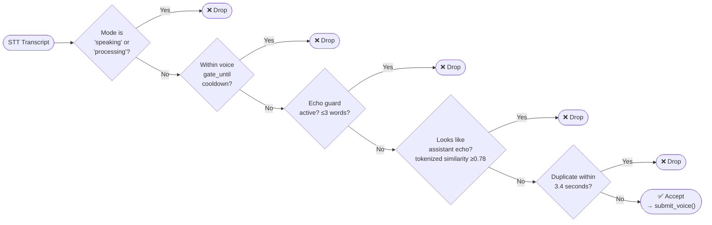

<div align="center">

[](.)

[](.)
[](.)
[](.)

</div>

---

## 🧠 Routing Strategy

JARVIS uses a **four-tier, priority-ordered routing system** implemented in `core/runtime.py`. Queries descend through each tier until a handler claims them.



---

## ⚡ Tier 1 — Priority Intent Router

The router is a **sorted list of `IntentRoute` objects**, each with a matcher function, handler function, and numeric priority. The first handler whose matcher returns `True` wins — all others are skipped.

### Handler Registry (Priority Order)

| Priority | Route Name | Matcher Trigger | Handler |
|---|---|---|---|
| 5 | `correction` | "that's wrong" · "incorrect" · bare "no" | Re-run last fact source |
| 8 | `set_user_name` | "my name is X" · "call me X" | Store name in MemoryStore |
| 9 | `query_user_name` | "what's my name" · "who am I" | Recall stored name |
| 10 | `greeting` | "hi" · "hello" · "good morning/evening" (≤8 words, no tool markers) | Time-aware greeting |
| 11 | `set_session_location` | "i am in X" (no other tool marker, no ?) | Update session location |
| 12 | `wellbeing` | "how are you" · "hru" · "how r u" | Wellbeing response |
| 13 | `capabilities` | "what can you do" · "your capabilities" | Capability summary |
| 14 | `help` | Exact: "help" · "commands" · "list commands" | Quick command reference |
| 15 | `search_policy` | "check internet" · "verify online" (non-query form) | Acknowledge + store preference |
| 16 | `abuse_feedback` | Abuse words without tool markers | Redirect constructively |
| 17 | `ambiguous_season` | Bare "2025 season" with no sport context | Ask for clarification |
| 18 | `speedtest` | "speed test" · "internet speed" · speedtest follow-up | SpeedTest service |
| 19 | `connectivity` | "check internet connectivity" · "am i online" | Deterministic probe |
| 20 | `public_ip` | "my ip" · "public ip" · "external ip" | ipify / ifconfig probe |
| 21 | `network_location` | "where am i" · "network location" (no IP marker) | IP geolocation |
| 22 | `weather` | "weather" · "temperature" · "forecast" anywhere in query | Open-Meteo |
| 23 | `system_status` | "system status" · "pc status" · "how is my device" | psutil snapshot |
| 24 | `temporal` | "current time" · "what time" · "today's date" | datetime.now() |
| 25 | `update_status` | "system update" · "version" · "patch" | Build version info |
| 26 | `document_qa` | Has active docs + QA hint markers (no explicit upload) | Retrieval-backed Q&A |
| 27 | `document` | "analyze document" · "open file picker" · "pdf" / "docx" | Full pipeline |
| 30 | `search_factual` | "search" · "news" · factual who/what/when patterns | Agent loop + Gemini Grounding |

---

## 🤖 Tier 2 — Agent Loop Gating

After the router passes, `AgentLoop.should_use_agent()` decides whether to enter the planner:



---

## 📄 Document Routing — Detailed

Document routing has critical disambiguation logic that prevents the file picker from opening when the user asks for a regular file browser.

```mermaid
flowchart TD
    A(["Query with\ndocument/file keywords"]) --> B{FILE_MANAGER_RE?\n"file explorer"\n"file manager"\n"windows explorer"}
    B -->|"Yes"| C(["→ app_control\nOpen File Explorer"])

    B -->|"No"| D{DOCUMENT_PICKER_RE?\n"open file picker"\n"open document selector"\n"select document"\n"choose pdf"...}
    D -->|"Yes"| E(["→ document branch\nOpen file picker"])

    D -->|"No"| F{Has active docs?\n_active_documents non-empty}
    F -->|"No"| G{DOCUMENT_RE?\n"analyze · summarize · read\npdf · docx · document"}
    G -->|"Yes"| E
    G -->|"No"| H(["→ LLM / agent fallback"])

    F -->|"Yes"| I{Explicit multi-file\ncompare request?\n"compare the 2 documents"\n"compare these two files"}
    I -->|"Yes"| E

    I -->|"No"| J{DOCUMENT_QA_HINT_RE?\n"pricing · risk · feature\nplan · entities · cost\nfind all · in this document"}
    J -->|"Yes"| K(["→ document_qa\nRetrieval-backed Q&A"])
    J -->|"No"| L{Last fact source\nis document?\n+ question word}
    L -->|"Yes"| K
    L -->|"No"| G

    style C fill:#0078D6,color:#fff,stroke:none
    style E fill:#7C3AED,color:#fff,stroke:none
    style K fill:#00C853,color:#fff,stroke:none
```

---

## 🌐 Factual and Search Routing

```mermaid
flowchart TD
    A(["Factual / Search Query"]) --> B{Matches any\ndeterministic service?\nweather · IP · speedtest\nconnectivity · status · temporal}
    B -->|"Yes"| C(["→ Deterministic handler\n(not search)"])

    B -->|"No"| D{Document intent?}
    D -->|"Yes"| E(["→ Document branch"])

    D -->|"No"| F{_is_search_request()?\nexplicit 'search' keyword\n'latest news' · 'who won'+'factual'}
    F -->|"Yes"| G["_build_effective_search_query()\n→ IPL year normalization\n→ follow-up context injection"]

    F -->|"No"| H{_is_factual_query()?\noffice holder · IPL season\nholiday · 'is X still the PM'}
    H -->|"Yes"| G

    G --> I["agent_loop.run(query)\nPlanner → Gemini Grounding → Synthesizer"]
    I --> J(["Web-evidence response"])
    H -->|"No"| K(["→ LLM fallback"])
```

---

## 🚫 Anti-Collision Rules

These rules prevent routing ambiguity across similar-sounding intents:

| Collision Risk | Resolution |
|---|---|
| `check internet connectivity` → search policy | `SEARCH_POLICY_RE` checks for `CONNECTIVITY_RE` and excludes it explicitly |
| `open file explorer` → document picker | `FILE_MANAGER_RE` checked before `DOCUMENT_PICKER_RE`; routes to `app_control` |
| `i am in pune, weather?` → location only | `?` in query disables `set_session_location` handler; routes to `weather` |
| `open document selector` → app control | `DOCUMENT_PICKER_RE` is checked explicitly before app control routing |
| `max volume` → unknown action | `SystemControlValidator` maps `max volume` → `set_volume level=100` |
| `2025 season` → wrong sport | `AMBIGUOUS_SEASON_RE` catches bare season queries; asks for sport context |
| `close it` → no target | `AppControlService` falls back to `memory.get('last_opened_app')` |
| `weather again` → weather without city | `TextCleaner.had_again` injects `memory.get('last_city')` before routing |

---

## 🎤 Voice Echo Guard

The `JarvisBridge` implements an echo guard to prevent the microphone from picking up JARVIS's own speech:



---

## 📊 Routing Performance Profile

| Tier | Latency | When Used |
|---|---|---|
| Local handler (P1–P30) | ~0ms | Greetings, wellbeing, memory, deterministic services |
| Deterministic service (P18–P27) | 50–800ms | Weather, IP, speedtest, connectivity, document QA |
| Agent loop + tools | 1–5s | Factual queries, multi-tool requests, app control |
| LLM stream fallback | 0.5–3s TTFT | General knowledge, conceptual questions |
| Document pipeline (first run) | 5–45s | PDF/DOCX/image analysis (cached on second run) |

---

<div align="center">

> **Design Goal: Correct routing > fast routing.**  
> A slow but correct answer builds trust. A fast but wrong answer destroys it.

[](.)

</div>